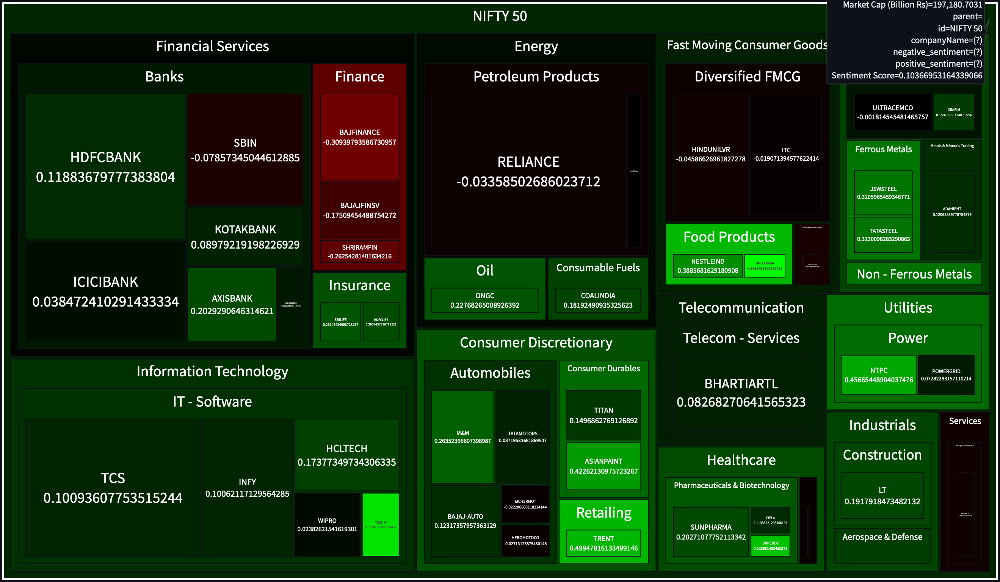

# Nifty-500 Live Sentiment Analysis

Real-time sentiment analysis of Nifty-500 stocks and Indices.



## Overview

This project analyzes the sentiment of Nifty-500 stocks in real-time, providing insights into market trends and investor sentiment.

Ticker specific articles are sourced from the following sources everyday and stored in a persistent (duckdb) database
- google finance
- yahoo finance
- google news [🚧 WIP]
- stocktwits [🚧 WIP]

which are then processed for sentiment analysis using [yiyanghkust/finbert-tone](https://huggingface.co/yiyanghkust/finbert-tone) model offline using Github Actions.

<details>

<summary>Info about BERT model used</summary>

🚧 To be added

</details>


Live instances of the app can be found on [Streamlit Cloud](https://nifty-sad.streamlit.app/)

Here is the link to [Companion Article](https://xumitcapital.medium.com/sentiment-analysis-dashboard-using-python-d40506e2709d).

<!--  # TODO: update installation and usage methods  -->

## Installation

```bash
# Clone the repository
git clone https://github.com/shubxam/Nifty-500-Live-Sentiment-Analysis.git
cd Nifty-500-Live-Sentiment-Analysis

# make sure you have UV installed.
curl -LsSf https://astral.sh/uv/install.sh | sh

# Install dependencies
make install-dev
```

## Usage

```bash
# Run the application
make run

# generate the dashboard
make dashboard
```

to use the streamlit dashboard:

```bash
git checkout streamlit
streamlit run generate-dashboard.py
```

## Project Analytics


