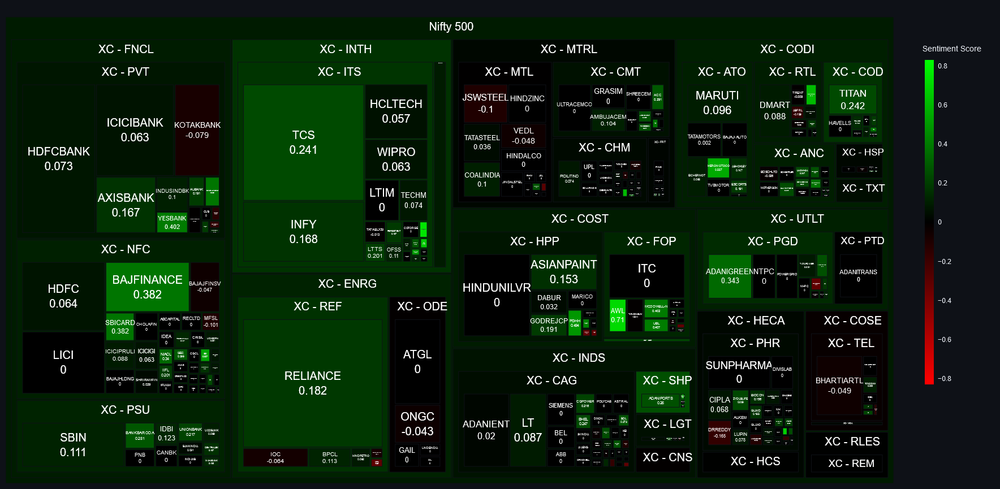

# Nifty 500 Live Sentiment Analysis Dashboard

Preview of the dashboard: 

---

A live Sentiment Analysis Dashboard powered by python and streamlit.

Headlines are parsed using [ProsusAI/finbert](https://huggingface.co/ProsusAI/finbert) for sentiment analysis.

Live instances of the app can be found
1. [Streamlit Cloud](https://nifty-sad.streamlit.app/)
2. [Github Pages](https://shubxam.github.io/NIFTY_500_live_sentiment.html)
3. [Companion Article](https://xumitcapital.medium.com/sentiment-analysis-dashboard-using-python-d40506e2709d)
